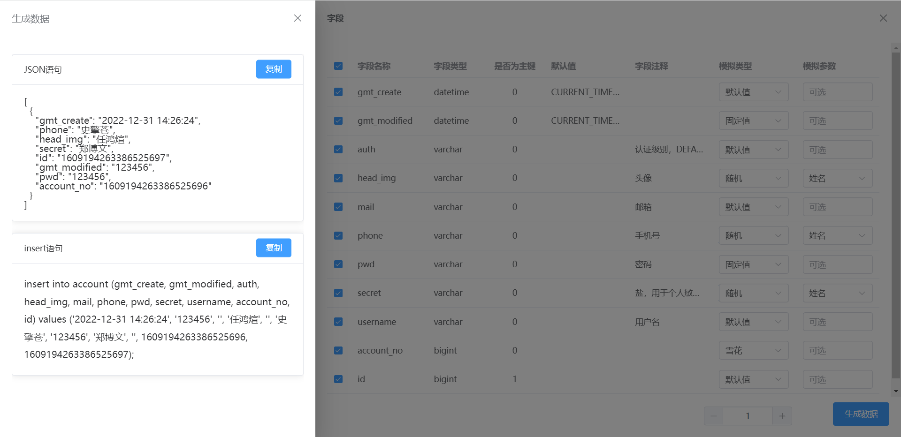
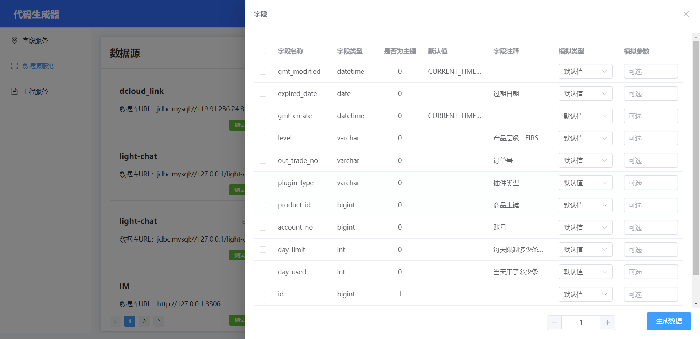

# 研发背景 
项目的创作主要来源于工作中，在工作中经常遇到数据库的表变成具体的某个类时，需要写大量无意义的代码。生成的好的代码的代码生成器需要找资源破解，框架自带的生成器又无法满足自己的想法<br>
同时，当需要数据测试，又不想自己构造数据。借鉴了maku-generator和sqlfather，诞生了这款代码生成器。
# 后端地址
[https://github.com/zhouzhou98/code-produce](https://github.com/zhouzhou98/code-produce)
# 项目功能图

# 项目演示图


# 技术栈
|  技术栈   | 
|  ----  |
|vue 3.2.13 Vue3|
|axios 1.2.1 网络请求|
|element-plus 2.2.26 组件库|
|vue-clipboard3 2.0.0 复制功能|
|vue-router 4.0.3 网页路由|
|less 4.1.3 高级css|
|typescript 4.5.5 类型控制|
|eslint 7.32.0 规范化代码|
|prettier 2.4.1 美化代码|
# 应用场景
## 导入数据库


支持快捷导入数据库的表和字段，还可以同步表字段数据
## 多语言生成

选择已经创建的工程和表名，不仅可以生成Java代码，还能生成TYPESCRIPT代码，并通过oss下载出zip覆盖即可
请求访问端口post请求：ip:8000/coder-server/api/v1/generate/code/{数据源id}/{工程id}/{类型}，其中类型
## 数据生成
请求访问端口post请求：ip:8000/coder-server/api/v1/generate/code/data


通过填写可视化表单的方式，快速生成模拟数据和代码，告别重复工作，还提供一键复制功能
## 工程服务

可以对工程服务进行增删改查的功能
# 快速启动
## 安装依赖
```
npm install
```
## 运行
```
npm run dev
```
## 打包
```
npm run build
```